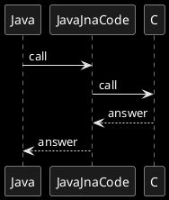

# Bibliothèque à télécharger
```xml
<dependency>
    <groupId>net.java.dev.jna</groupId>
    <artifactId>jna</artifactId>
    <version>5.0.0</version>
</dependency>
```

# Développer une bibliothèque native via le langage C

## Etapes de construction
```plantuml
skinparam monochrome reverse
start
fork
:create hello.h and hello.c;
:create hello.o\ngcc -c hello.c -o hello.o;
:gcc -shared hello.o -o libhello.so ;
fork again
:create mvn project\nadd JNA dependency in pom;
    fork
    :copy libhello.so to\ntarget/linux-x86-64\nwith maven-resources-plugin;
    fork again    
    :make jar executable with\nmaven-jar-plugin\put dependecies in same jar\nwith maven-dependency-plugin;
    fork again
    :shade to include\nnet.java.dev.jna:jna and \nnet.java.dev.jna:jna-platform;     
    end fork
:create CHello.java interface\nand make link with C;
:create App.java;
end fork
:oganise c files within mvn projetcs in src/main/resources;
:compile and run App.java;
stop
```

## Principes
