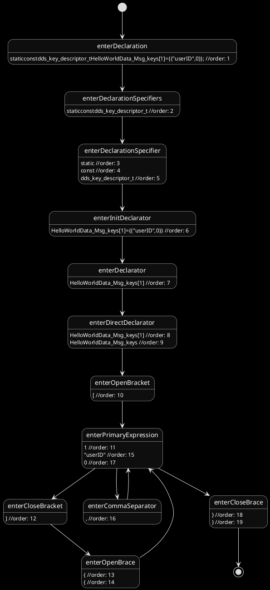

State diagrams for walker
=========================

# Example 1 with 
```C
static const dds_key_descriptor_t HelloWorldData_Msg_keys[1] =
{
  { "userID", 0 }
};
````

# Example 2 with

```C
static const uint32_t HelloWorldData_Msg_ops [] =
{
  DDS_OP_ADR | DDS_OP_TYPE_4BY | DDS_OP_FLAG_KEY, offsetof (HelloWorldData_Msg, userID),
  DDS_OP_ADR | DDS_OP_TYPE_STR, offsetof (HelloWorldData_Msg, message),
  DDS_OP_RTS
};
```

```plantuml
skinparam monochorme true
skinparam monochrome reverse
[*] --> enterDeclarationSpecifier
enterDeclarationSpecifier: static //order: 1
enterDeclarationSpecifier: const //order: 2
enterDeclarationSpecifier: uint32_t //order: 3
enterDeclarationSpecifier --> enterDeclarator
enterDeclarator: HelloWorldData_Msg_ops[] //order: 4
enterDeclarator --> enterDirectDeclarator
enterDirectDeclarator: HelloWorldData_Msg_ops[] //order: 5
enterDirectDeclarator: HelloWorldData_Msg_ops //order: 6
enterDirectDeclarator --> enterOpenBracket
enterOpenBracket: [ //order: 7
enterOpenBracket --> enterCloseBracket
enterCloseBracket: ] //order: 8
enterCloseBracket --> enterInitializer
enterInitializer: {DDS_OP_ADR|DDS_OP_TYPE_4BY|DDS_OP_FLAG_KEY,offsetof(HelloWorldData_Msg,userID),DDS_OP_ADR|DDS_OP_TYPE_STR,offsetof(HelloWorldData_Msg,message),DDS_OP_RTS} //order: 9
enterInitializer --> enterOpenBrace
enterOpenBrace: { //order: 10
enterOpenBrace --> enterInitializer
enterInitializer: DDS_OP_ADR|DDS_OP_TYPE_4BY|DDS_OP_FLAG_KEY //order: 11
enterInitializer --> enterPrimaryExpression
enterPrimaryExpression: DDS_OP_ADR //order: 12
enterPrimaryExpression --> enterOr
enterOr: | //order: 13
enterOr --> enterPrimaryExpression
enterPrimaryExpression: DDS_OP_TYPE_4BY //order: 14
enterPrimaryExpression --> enterOr
enterOr: | //order: 15
enterOr --> enterPrimaryExpression
enterPrimaryExpression: DDS_OP_FLAG_KEY //order: 16
enterPrimaryExpression --> enterCommaSeparator
enterCommaSeparator: , //order: 17
enterCommaSeparator --> enterInitializer
enterInitializer: offsetof(HelloWorldData_Msg,userID) //order: 18
enterInitializer --> enterPrimaryExpression
enterPrimaryExpression: offsetof //order: 19
enterPrimaryExpression: HelloWorldData_Msg //order: 20
enterPrimaryExpression: userID //order: 21
enterPrimaryExpression --> enterCommaSeparator
enterCommaSeparator: , //order: 22
enterCommaSeparator --> enterInitializer
enterInitializer: DDS_OP_ADR|DDS_OP_TYPE_STR //order: 23
enterInitializer --> enterPrimaryExpression
enterPrimaryExpression: DDS_OP_ADR //order: 24
enterPrimaryExpression --> enterOr
enterOr: | //order: 25
enterOr --> enterPrimaryExpression
enterPrimaryExpression: DDS_OP_TYPE_STR //order: 26
enterPrimaryExpression --> enterCommaSeparator
enterCommaSeparator: , //order: 27
enterCommaSeparator --> enterInitializer
enterInitializer: offsetof(HelloWorldData_Msg,message) //order: 28
enterInitializer --> enterPrimaryExpression
enterPrimaryExpression: offsetof //order: 29
enterPrimaryExpression: HelloWorldData_Msg //order: 30
enterPrimaryExpression: message //order: 31
enterPrimaryExpression --> enterCommaSeparator
enterCommaSeparator: , //order: 32
enterCommaSeparator --> enterInitializer
enterInitializer: DDS_OP_RTS //order: 33
enterInitializer --> enterPrimaryExpression
enterPrimaryExpression: DDS_OP_RTS //order: 34
enterPrimaryExpression --> enterCloseBrace
enterCloseBrace: } //order: 35
enterCloseBrace --> [*]

```

# Example 3 with 
```C
const dds_topic_descriptor_t HelloWorldData_Msg_desc =
{
  sizeof (HelloWorldData_Msg),
  sizeof (char *),
  DDS_TOPIC_FIXED_KEY | DDS_TOPIC_NO_OPTIMIZE,
  1u,
  "HelloWorldData::Msg",
  HelloWorldData_Msg_keys,
  3,
  HelloWorldData_Msg_ops,
  "<MetaData version=\"1.0.0\"><Module name=\"HelloWorldData\"><Struct name=\"Msg\"><Member name=\"userID\"><Long/></Member><Member name=\"message\"><String/></Member></Struct></Module></MetaData>"
};
````

```plantuml
skinparam monochrome true
skinparam monochrome reverse
[*] --> enterDeclarationSpecifier
enterDeclarationSpecifier: const //order: 1
enterDeclarationSpecifier: dds_topic_descriptor_t //order: 2
enterDeclarationSpecifier --> enterDeclarator
enterDeclarator: HelloWorldData_Msg_desc //order: 3
enterDeclarator --> enterDirectDeclarator
enterDirectDeclarator: HelloWorldData_Msg_desc //order: 4
enterDirectDeclarator --> enterInitializer
enterInitializer: {sizeof(HelloWorldData_Msg),sizeof(char*),DDS_TOPIC_FIXED_KEY|DDS_TOPIC_NO_OPTIMIZE,1u,"HelloWorldData::Msg",HelloWorldData_Msg_keys,3,HelloWorldData_Msg_ops,"<MetaData version=\"1.0.0\"><Module name=\"HelloWorldData\"><Struct name=\"Msg\"><Member name=\"userID\"><Long/></Member><Member name=\"message\"><String/></Member></Struct></Module></MetaData>"} //order: 5
enterInitializer --> enterOpenBrace
enterOpenBrace: { //order: 6
enterOpenBrace --> enterInitializer
enterInitializer: sizeof(HelloWorldData_Msg) //order: 7
enterInitializer --> enterPrimaryExpression
enterPrimaryExpression: (HelloWorldData_Msg) //order: 8
enterPrimaryExpression: HelloWorldData_Msg //order: 9
enterPrimaryExpression --> enterCommaSeparator
enterCommaSeparator: , //order: 10
enterCommaSeparator --> enterInitializer
enterInitializer: sizeof(char*) //order: 11
enterInitializer --> enterCommaSeparator
enterCommaSeparator: , //order: 12
enterCommaSeparator --> enterInitializer
enterInitializer: DDS_TOPIC_FIXED_KEY|DDS_TOPIC_NO_OPTIMIZE //order: 13
enterInitializer --> enterPrimaryExpression
enterPrimaryExpression: DDS_TOPIC_FIXED_KEY //order: 14
enterPrimaryExpression --> enterOr
enterOr: | //order: 15
enterOr --> enterPrimaryExpression
enterPrimaryExpression: DDS_TOPIC_NO_OPTIMIZE //order: 16
enterPrimaryExpression --> enterCommaSeparator
enterCommaSeparator: , //order: 17
enterCommaSeparator --> enterInitializer
enterInitializer: 1u //order: 18
enterInitializer --> enterPrimaryExpression
enterPrimaryExpression: 1u //order: 19
enterPrimaryExpression --> enterCommaSeparator
enterCommaSeparator: , //order: 20
enterCommaSeparator --> enterInitializer
enterInitializer: "HelloWorldData::Msg" //order: 21
enterInitializer --> enterPrimaryExpression
enterPrimaryExpression: "HelloWorldData::Msg" //order: 22
enterPrimaryExpression --> enterCommaSeparator
enterCommaSeparator: , //order: 23
enterCommaSeparator --> enterInitializer
enterInitializer: HelloWorldData_Msg_keys //order: 24
enterInitializer --> enterPrimaryExpression
enterPrimaryExpression: HelloWorldData_Msg_keys //order: 25
enterPrimaryExpression --> enterCommaSeparator
enterCommaSeparator: , //order: 26
enterCommaSeparator --> enterInitializer
enterInitializer: 3 //order: 27
enterInitializer --> enterPrimaryExpression
enterPrimaryExpression: 3 //order: 28
enterPrimaryExpression --> enterCommaSeparator
enterCommaSeparator: , //order: 29
enterCommaSeparator --> enterInitializer
enterInitializer: HelloWorldData_Msg_ops //order: 30
enterInitializer --> enterPrimaryExpression
enterPrimaryExpression: HelloWorldData_Msg_ops //order: 31
enterPrimaryExpression --> enterCommaSeparator
enterCommaSeparator: , //order: 32
enterCommaSeparator --> enterInitializer
enterInitializer: "<MetaData version=\"1.0.0\"><Module name=\"HelloWorldData\"><Struct name=\"Msg\"><Member name=\"userID\"><Long/></Member><Member name=\"message\"><String/></Member></Struct></Module></MetaData>" //order: 33
enterInitializer --> enterPrimaryExpression
enterPrimaryExpression: "<MetaData version=\"1.0.0\"><Module name=\"HelloWorldData\"><Struct name=\"Msg\"><Member name=\"userID\"><Long/></Member><Member name=\"message\"><String/></Member></Struct></Module></MetaData>" //order: 34
enterPrimaryExpression --> enterCloseBrace
enterCloseBrace: } //order: 35
enterCloseBrace --> [*]
```


## Example 1 and 2 mixed
```plantuml
skinparam monochrome true
skinparam monochrome reverse
[*] --> enterDeclarationSpecifier
enterDeclarationSpecifier: static //order: 1
enterDeclarationSpecifier: const //order: 2
enterDeclarationSpecifier: dds_key_descriptor_t //order: 3
enterDeclarationSpecifier --> enterDeclarator
enterDeclarator: HelloWorldData_Msg_keys[1] //order: 4
enterDeclarator --> enterDirectDeclarator
enterDirectDeclarator: HelloWorldData_Msg_keys[1] //order: 5
enterDirectDeclarator: HelloWorldData_Msg_keys //order: 6
enterDirectDeclarator --> enterOpenBracket
enterOpenBracket: [ //order: 7
enterOpenBracket --> enterPrimaryExpression
enterPrimaryExpression: 1 //order: 8
enterPrimaryExpression --> enterCloseBracket
enterCloseBracket: ] //order: 9
enterCloseBracket --> enterOpenBrace
enterOpenBrace: { //order: 10
enterOpenBrace: { //order: 11
enterOpenBrace --> enterPrimaryExpression
enterPrimaryExpression: "userID" //order: 12
enterPrimaryExpression --> enterCommaSeparator
enterCommaSeparator: , //order: 13
enterCommaSeparator --> enterPrimaryExpression
enterPrimaryExpression: 0 //order: 14
enterPrimaryExpression --> enterCloseBrace
enterCloseBrace: } //order: 15
enterCloseBrace: } //order: 16
enterCloseBrace --> enterDeclarationSpecifier
enterDeclarationSpecifier: static //order: 17
enterDeclarationSpecifier: const //order: 18
enterDeclarationSpecifier: uint32_t //order: 19
enterDeclarationSpecifier --> enterDeclarator
enterDeclarator: HelloWorldData_Msg_ops[] //order: 20
enterDeclarator --> enterDirectDeclarator
enterDirectDeclarator: HelloWorldData_Msg_ops[] //order: 21
enterDirectDeclarator: HelloWorldData_Msg_ops //order: 22
enterDirectDeclarator --> enterOpenBracket
enterOpenBracket: [ //order: 23
enterOpenBracket --> enterCloseBracket
enterCloseBracket: ] //order: 24
enterCloseBracket --> enterOpenBrace
enterOpenBrace: { //order: 25
enterOpenBrace --> enterPrimaryExpression
enterPrimaryExpression: DDS_OP_ADR //order: 26
enterPrimaryExpression --> enterOr
enterOr: | //order: 27
enterOr --> enterPrimaryExpression
enterPrimaryExpression: DDS_OP_TYPE_4BY //order: 28
enterPrimaryExpression --> enterOr
enterOr: | //order: 29
enterOr --> enterPrimaryExpression
enterPrimaryExpression: DDS_OP_FLAG_KEY //order: 30
enterPrimaryExpression --> enterCommaSeparator
enterCommaSeparator: , //order: 31
enterCommaSeparator --> enterPrimaryExpression
enterPrimaryExpression: offsetof //order: 32
enterPrimaryExpression: HelloWorldData_Msg //order: 33
enterPrimaryExpression: userID //order: 34
enterPrimaryExpression --> enterCommaSeparator
enterCommaSeparator: , //order: 35
enterCommaSeparator --> enterPrimaryExpression
enterPrimaryExpression: DDS_OP_ADR //order: 36
enterPrimaryExpression --> enterOr
enterOr: | //order: 37
enterOr --> enterPrimaryExpression
enterPrimaryExpression: DDS_OP_TYPE_STR //order: 38
enterPrimaryExpression --> enterCommaSeparator
enterCommaSeparator: , //order: 39
enterCommaSeparator --> enterPrimaryExpression
enterPrimaryExpression: offsetof //order: 40
enterPrimaryExpression: HelloWorldData_Msg //order: 41
enterPrimaryExpression: message //order: 42
enterPrimaryExpression --> enterCommaSeparator
enterCommaSeparator: , //order: 43
enterCommaSeparator --> enterPrimaryExpression
enterPrimaryExpression: DDS_OP_RTS //order: 44
enterPrimaryExpression --> enterCloseBrace
enterCloseBrace: } //order: 45
enterCloseBrace --> [*]
```

## Exemple 4

```C

```

```plantuml
skinparam monochrome true
skinparam monochrome reverse
[*] --> enterDeclarationSpecifier
enterDeclarationSpecifier: static //order: 1
enterDeclarationSpecifier: const //order: 2
enterDeclarationSpecifier: dds_key_descriptor_t //order: 3
enterDeclarationSpecifier --> enterDeclarator
enterDeclarator: HelloWorldData_Msg_keys[2] //order: 4
enterDeclarator --> enterDirectDeclarator
enterDirectDeclarator: HelloWorldData_Msg_keys[2] //order: 5
enterDirectDeclarator: HelloWorldData_Msg_keys //order: 6
enterDirectDeclarator --> enterOpenBracket
enterOpenBracket: [ //order: 7
enterOpenBracket --> enterPrimaryExpression
enterPrimaryExpression: 2 //order: 8
enterPrimaryExpression --> enterCloseBracket
enterCloseBracket: ] //order: 9
enterCloseBracket --> enterOpenBrace
enterOpenBrace: { //order: 10
enterOpenBrace: { //order: 11
enterOpenBrace --> enterPrimaryExpression
enterPrimaryExpression: "userID" //order: 12
enterPrimaryExpression --> enterCommaSeparator
enterCommaSeparator: , //order: 13
enterCommaSeparator --> enterPrimaryExpression
enterPrimaryExpression: 0 //order: 14
enterPrimaryExpression --> enterCloseBrace
enterCloseBrace: } //order: 15
enterCloseBrace --> enterCommaSeparator
enterCommaSeparator: , //order: 16
enterCommaSeparator --> enterOpenBrace
enterOpenBrace: { //order: 17
enterOpenBrace --> enterPrimaryExpression
enterPrimaryExpression: "nextID" //order: 18
enterPrimaryExpression --> enterCommaSeparator
enterCommaSeparator: , //order: 19
enterCommaSeparator --> enterPrimaryExpression
enterPrimaryExpression: 2 //order: 20
enterPrimaryExpression --> enterCloseBrace
enterCloseBrace: } //order: 21
enterCloseBrace: } //order: 22
enterCloseBrace-->[*]

```